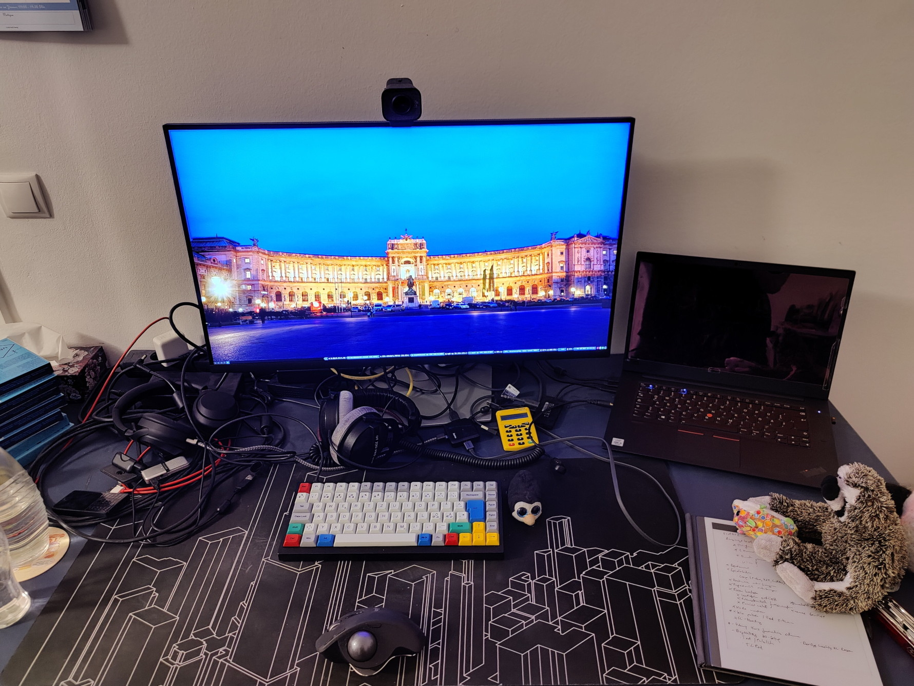

---

date: 2021-12-20 12:01:12+00:00
draft: false
title: Home Office Workplace
---

## Schreibtisch und Stuhl

Als Stehtisch ist ein Lista Office Extend mit schwarzer Tischplatte und
schwarzem Gestell im Einsatz und zum Sitzen habe ich bereits seit einem
Jahrzeit einen Swopper auf Rollen im Einsatz. Der vermeidet super meine
Rückenschmerzen. Vorsicht: Die ersten zwei Wochen bekommt man davon gerne mal
Muskelkater.

## Laptop

Lenovo ThinkPad P1 Gen 3 mit 64 GB RAM, 8 Kernen und NVMe hat dieser genug
Power um auch unterwegs mal komplexere Setups mit VMs zu testen und mit
ordentlicher Tastatur, Trackpoint mit echten Maus-Tasten und 4K-Monitor auch
sonst gut für unterwegs.

## Bildschirm

Als externer Monitor kommt ein Dell P3222QE zum Einsatz. Gross, matt, Anschluss
per USB-C und mit integriertem Dock braucht man keinen zweiten Monitor auf dem
Tisch.

## Audio und Video

Unterwegs oder auch für kleinere Einsätze dient das Samson Go Mic als Mikrofon.
Im HomeOffice übernimmt den Job ein Rhode NT USB mini. Da Telefonate und
Video-Konferenzen spätestens mit der Corona-Pandemie länger geworden sind, ist
bei mir das Beyerdynamics DT 770 Pro eingezogen. Die Verbesserung des
Tragekomforts im Vergleich zum vorherigen Plantronics Headset ist so viel
besser.

Als Kamera habe ich die Logitech StreamCam im Einsatz.

## Peripherie

Schon seit den 1990ern begleitet mich immer wieder ein Trackball. Inzwischen ist
es der Logitech MX Ergo. Mit der Querstellung vor der Tastatur sind damit die
auftretenden Pseudo-Karpaltunnelsyndrome weg.

Als Tastatur habe ich nach langer Recherche die Vortex Tab 75 mit braunen
Cherry-Switches beschafft und bin so zufrieden damit, dass ich von dieser
inzwischen sogar eine auf Reserve habe.

## Sonstiges auf dem Tisch

Um die Geräusche der Tastatur etwas zu dämpfen und weil sie hübsch ist, liegt
eine Deskmatte von Ikea auf dem Tisch. Für jegliche Notizen, Bulletjournaling,
Besprechungsnotizen und alles wo andere Personen Papier nutzen kommt ein
Remarkable 2 zum Einsatz.

Für die Musik zum Arbeiten, zum Unterdrücken von Störgeräuschen oder für
Podcasts in der Pause oder beim Laufen nutze ich den Sony WH-1000XM4. Dieser
hat den WH-1000XM3 und dieser den Bose QC25 ersetzt.

Als externe Motivation und für das Rubberduck-Debugging ist mindestens ein
Plüschtier im Einsatz. Redundanz ist auch vorhanden ;)

