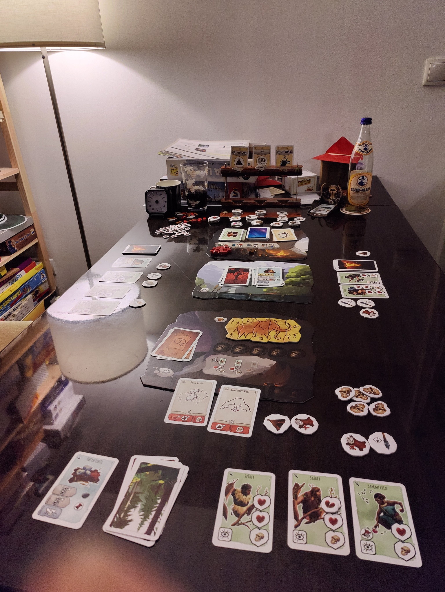
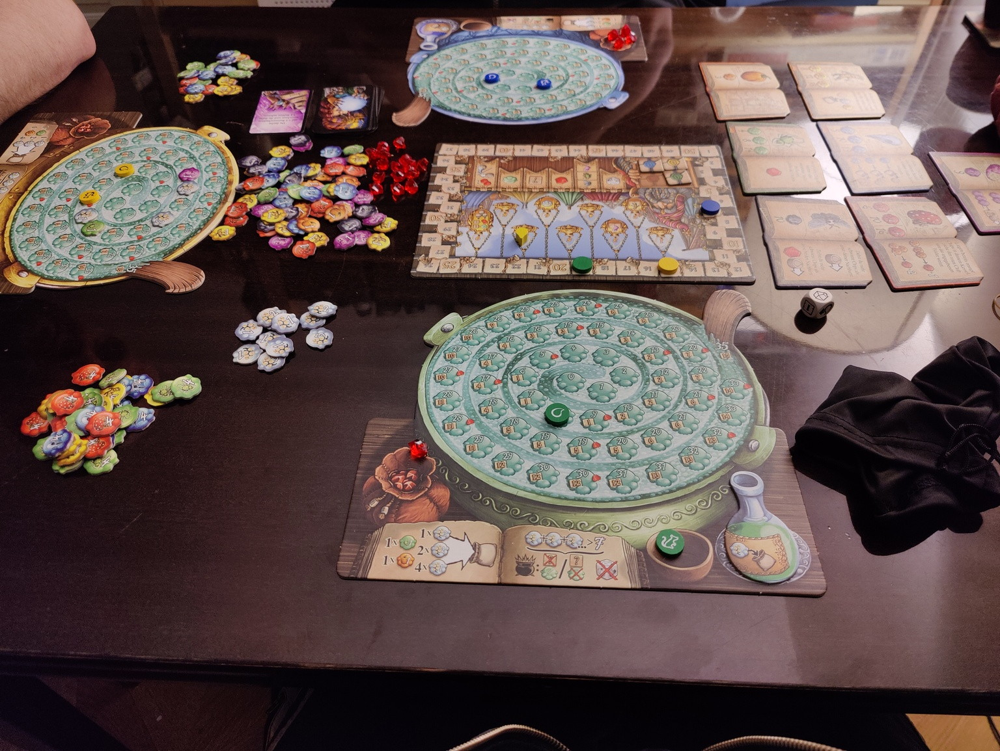
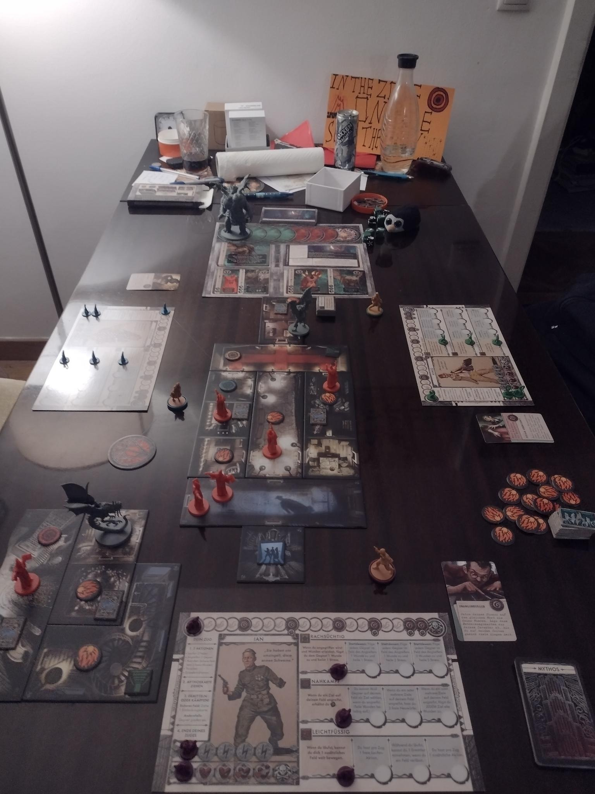
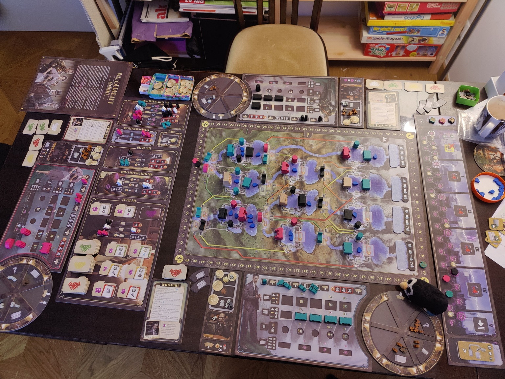

---

date: 2022-02-01 00:01:00+00:00
draft: False
title: Rückblick Brettspiele Feiertage 2021
categories:
- Brettspiele
---

Zu Weihnachten und Silvester 2021 haben wir hier relativ viele Brettspiele
gespielt und ich möchte euch gerne einen Rückblick über die gespielten Spiele
und meine Entschätzung dieser teilen.

## Paleo

Ein kooperatives Spiel in der Steinzeit mit Karten statt Würfeln Als Stamm muss
man gemeinsam die Mission erfüllen und gleichzeitig dürfen nicht mehr als fünf
Personen sterben, da man ansonsten verliert. Man darf sich abstimmen und die
Regeln sind nicht ganz einfach, aber extrem spannend.

## Fantastische Reiche

Ein schnelles kurzes Kartenspiel. Perfekt als Einstieg, Zwischenspiel am
Nebentisch wenn bei einem komplexen Spiel gerade die Luft raus ist oder
Absacker.

## Orleans

Ein klassisches Worker-Placement im Mittelalter. Grosse Ähnlichkeit zu
Stoneage, aber mit mehr aufeinander aufbauenden Aktionen über mehrere Züge
hinweg.

## Quacksalber von Quedlinburg mit Erweiterung Kräuterhexen

Kurz erklärt man zieht Chips aus einem Beutel und legt diese in seinen Kessel.
Man darf aber nicht zu viel Knallerbsen ziehen, da ansonsten der Kessel
explodiert. Mit der damit erspielten Währung kann man sich neue Chips in den
Beutel legen und so für zukünftige Runden die Auswahl verbessern.

Jede Farbe von Chip hat zusätzlich eine eigene Funktion im Kessel und teilweise
wirken sich diese auch auf einander aus.

Das Grundspiel zu den Quacksalbern haben wir bereits länger im Einsatz und
spielen es immer wieder gerne. Ein einfach erklärbares, aber trotzdem komplexes
Push-Your-Luck bzw. Bag-Building-Game. Mit den unterschiedlichen Rezeptbüchern
ist eh schon jede Partie anders.

Mit der ersten Erweiterung der Kräuterhexen wird nochmal jede Partie anders und
die Taktik ändert sich dadurch auch. Aus meiner Sich eine gute Erweiterung die
das Spiel nochmal verbessert und es trotzdem nicht sehr viel komplizierter
macht.

## Ein Fest für Odin

Ein Workerplacement im Wikingerstil. Die Gegenstände in den jeweiligen
Kategories sind aufrüstbar. Ziel ist es mit den gekauften Plättchen möglichst
viele Minuspunkte abzudecken.

## CTHULHU: Death May Die

Kooperatives Spiel im Lovecraft Universum. Eine Art Dungeoncrawler. Leider noch
zu schwer, aber wir arbeiten aktiv daran den grossen Alten zu besiegen. Und
dabei meinte die Beratung im [Spieleladen](https://www.sirengames.at/) meinte,
dass sei der einfacheste Dungeoncrawler im Cthulhu-Universum.

## Wasserkraft

Bei Wasserkraft spielt man die Betreiberin eines Wasserkrafts in den
1920er-Jahren in den Alpen und muss Stauwerke, Rohre und Generatoren bauen und
erhält Siegpunkte für die Erfüllung von Stromverträgen mit dem erzeugten Strom.

## Fazit

Spielt mehr Brettspiele. Es ist sehr gut und macht den Kopf frei. Falls es
gerade nicht offline vor Ort geht (z.B. weil gerade eine Pandemie herrscht),
dann kann ich [boardgamearena.com](https://boardgamearena.com) empfehlen.
